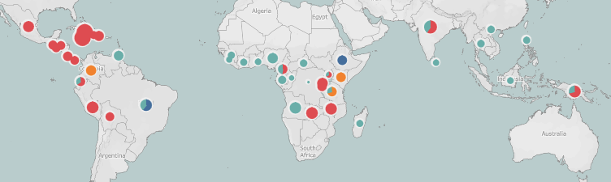
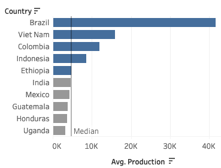
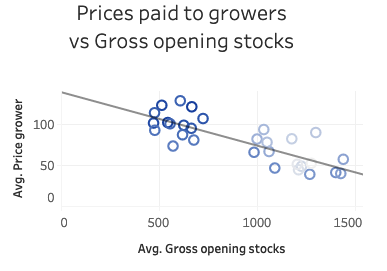
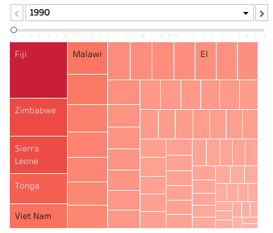
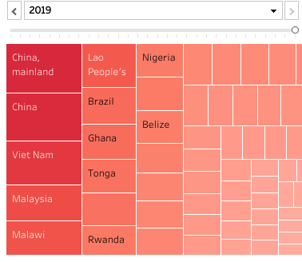
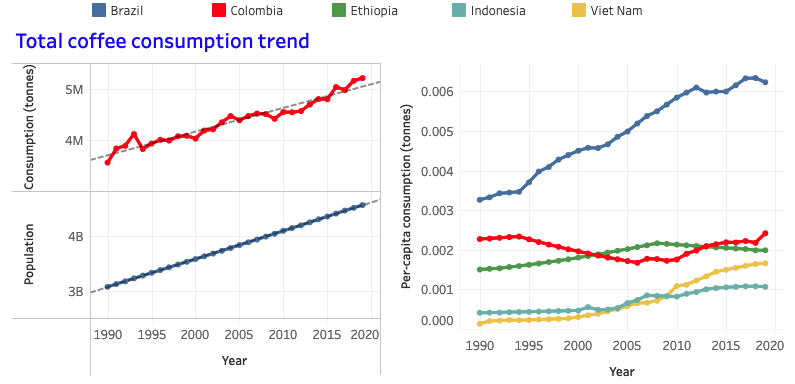

# Coffee Trading Trend Analysis

We analyze historical data on the global coffee trade from the [International Coffee Organization (ICO)](https://www.ico.org/new_historical.asp) and the [Food and Agriculture Organization (FAO) of the United Nations](https://www.fao.org). We make an interactive dashboard presenting production, consumption, exports, imports, and price for different countries and years.

 

This project is part of The Erdös Institute's data visualization mini-course. Jimin Kim, Parham Hamidi, Anirban Sharma, and Elizabeth Campolongo collaborated to make a Tableaux story and presented it in a 2-minute video. 

## Methods
- Data merging: python
- Data Visualization: python, Tableau
- Statistical Analysis

## Data

#### Data Collection

- Historical Data on the Global Coffee Trade https://www.ico.org/new_historical.asp 

International Coffee Organization(ICO) provides data on coffee industry over 30 years between 1990-2019. We select 9 .xlsx files: production, domestic consumption, gross opening stocks, exports, imports, re-exports, price to growers, retail price, and consumption recorded for different countries and years. 5 of them --production, domestic consumption, gross opening stocks, exports, price to growers-- includes data of the () exporting countries and 4 of them has data of of () importing countries.

- World Population https://data.worldbank.org/indicator/SP.POP.TOTL 

This dataset contains yearly population of all the countries from 1960 to 2021. We extract the population of the countries (in the ICO dataset) involved in coffee production or consumption from 1990 to 2019.

- Coffee Yield per ha https://www.fao.org/faostat/en/#data.

FAOSTAT provides food and agriculture data for over 245 countries and territories and covers all FAO regional groupings from 1961 to the most recent year available. We particularly use coffee production and coffee yield for the same period as the ICO data. 

#### Data Cleaning

Each excel file should be a feature in the dataframe in pandas. Our goal is to combine the tables in to one, using 'pd.melt'and 'pd.merge'. At the same time, we deal with missing values and redundant values. Also, messy string data is cleaned. 

- Structure: assign proper data type
- Quality: drop empty rows, unified format, remove unnessarily aggregated rows
- New Feature: add population and coffee yield per ha

## Analysis

#### Cross regional analysis on price paid to growers by coffee type and imports.

 

 United States and Germany import almost half of the coffee beans out of the total imports. The relative percentages of imports and price of coffee among consumer nations don’t change much over the 30 year period we examine. On the map, we have pie charts depicting the distribution of different types of coffee grown in producing countries. The size of these charts further corresponds to the average amount paid to the farmers growing the coffee. Jamaican farmers are consistently the highest (or nearly highest) paid, with only Bolivian farmers surpassing them in recent years--both grow non-Columbian mild beans. However, farmers from top producers like Brazil (and more recently, Viet Nam), are paid significantly less, on par with the vast majority of other producers.
 
#### Production trend by time. 

 

  The production of coffee is increasing in general. It has increased more than twice compared to 30 years ago. 
72% of coffee beans are produced by Top 5 countries: Brazil, Viet Nam, Colombia, Indonesia, and Ethiopia. Among them, Brazil has consistently been at the top. The increasing trend of production by the Top 2 countries is more significant than others. There are some feature showing a linear relationship. More production leads to more exports, but over-production leads to lower prices for growers. 

#### Land efficiency of coffee producing countries.

 

 As global production increases over time, global land efficiency also increased, which is the production per unit land(hg/ha). Global production has been growing faster than land efficiency. Almost all countries have improved their land efficiency over the years. However, for example, Fiji's land efficiency has been significantly dropped down. Land efficiency of Fiji was top in 1990 but the one of China became top in 2019.

#### Domenstic consumption vs population growth.

 

